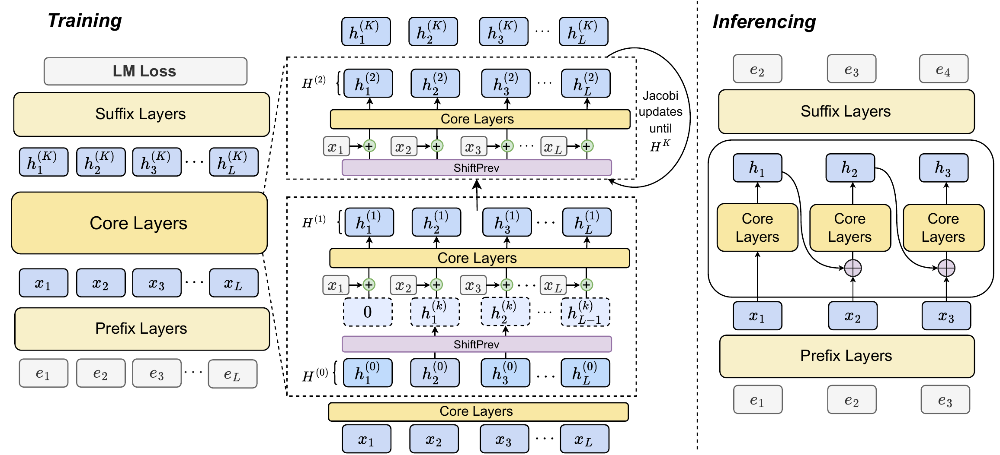

# P2N

**Reusing deep representations for greater effective depth.** This repository integrates P2N pretraining into [Megatron-LM](https://github.com/NVIDIA/Megatron-LM). A seven-layer core is reused through Jacobi updates while the prefix and suffix run once. The same 604M parameters support both P2N and a standard Transformer baseline.

## Overview



Let $X=\mathrm{Prefix}(E)$ be the input to the shared core. Training starts with a warm pass and applies $K$ Jacobi updates:

$$
H^{(0)}=\mathrm{Core}(X),\qquad
H^{(k+1)}=\mathrm{Core}\!\left(X+\mathrm{ShiftPrev}(H^{(k)})\right),\qquad
\mathrm{logits}=\mathrm{LMHead}\!\left(\mathrm{Suffix}(H^{(K)})\right).
$$

`ShiftPrev` zeros the first position and resets after each document boundary. The implementation uses $K\in\{2,3\}$ during training. The right side of the figure illustrates autoregressive inference; this repository implements the training path.

## Install

```bash
git clone https://github.com/ZitongWang018/p2n-megatron.git
cd p2n-megatron
bash scripts/install_p2n.sh
```

The install script reuses a compatible Lumia environment when available; otherwise it creates one outside the source tree with PyTorch 2.6.0. Set `P2N_DATA_ROOT` to choose where environments, datasets, logs, and checkpoints are stored (default: `/data3/$USER/p2n-megatron`).

## Quickstart

```bash
bash scripts/submit.sh quickstart
```

This launches four GPUs on the `RTX4090` Slurm partition. It uses the shared token data on Lumia when available; otherwise it downloads a small public token sample automatically. Logs and checkpoints are written under `$P2N_DATA_ROOT`. The quickstart runs two optimizer steps and checks the distributed training path.

On a machine with four visible GPUs but no Slurm, use `bash scripts/run.sh quickstart` instead.

## Pretrain

### Qwen3 70M experiment

The six-layer Qwen3 decoder uses a two-layer prefix, two-layer recurrent core,
and two-layer suffix. It has 74,325,248 parameters with separate input and
output embeddings and the Pythia 50,304-token vocabulary. Both baseline and
P2N use sequence length 2,048, eight RTX 4090 GPUs, microbatch 8 per GPU,
global batch 256, learning rate 1.5e-3, and 2,836 optimizer steps (20 tokens
per parameter). The training script reads the shared Lumia token stream and
logs to the `ZitongWang/P2N` SwanLab workspace. Supply `SWANLAB_API_KEY` in
`$P2N_DATA_ROOT/private/swanlab.env` with file mode 600; keep it outside Git.

```bash
METHOD=vanilla sbatch scripts/train_70m_8gpu.sbatch
METHOD=p2n sbatch scripts/train_70m_8gpu.sbatch
```

Use a Slurm `afterok` dependency to start P2N when the baseline completes.
The shared dataset uses the Pythia vocabulary and document-end token 0; data
prepared with another tokenizer needs matching `vocab_size` and `eod_id`.

Provide a contiguous Megatron `uint16` token stream (`.bin`, token IDs below 50,304):

```bash
TRAIN_BIN=/path/to/pile_train.bin bash scripts/submit.sh train

# Parameter-matched baseline
TRAIN_BIN=/path/to/pile_train.bin METHOD=vanilla bash scripts/submit.sh train
```

For a direct four-GPU launch without Slurm, replace `submit.sh` with `run.sh`.

The default recipe uses 2,048 tokens, global batch 1,024, BF16, AdamW, 57,221 steps, and a 5% warmup followed by cosine decay. Four 24 GiB GPUs use activation checkpointing and gradient accumulation. Set `VALID_BIN` for validation, `EOD_ID` for packed-document boundaries, and `RESUME_CHECKPOINT` to resume. Full paper-scale training requires approximately 120B tokens; the quickstart data is only for verifying execution. Record the tokenizer and EOD ID used to prepare your training stream.

## Implementation

| Component | Location |
| --- | --- |
| P2N model and recurrence | `p2n/model.py` |
| Token stream reader | `p2n/data.py` |
| Distributed pretraining | `pretrain_p2n.py` |
| Direct and Slurm launch scripts | `scripts/run.sh`, `scripts/submit.sh` |
| Megatron Core | `megatron/core/` |

The decoder follows Qwen3's GQA, RMSNorm, and SwiGLU layout. It has 21 layers, hidden size 1,280, FFN size 5,632, 20 query heads, five KV heads, and RoPE. P2N executes the core once to initialize its state, then applies two or three Jacobi updates per training step with full backpropagation. `METHOD=vanilla` runs each physical layer once. Token shifts and attention masks both reset at document boundaries.

This repository is based on Megatron-LM `core_v0.13.0` (`c550cf6c41c31cd3ec72e05c25ea0c979f2b6631`). The implementation currently covers pretraining and its parameter-matched baseline; downstream fine-tuning and generation are outside this release. See [LICENSE](LICENSE) for the upstream license.
